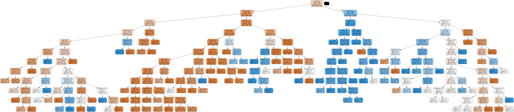

# <u>Titanic Survival Prediction</u>

Check it out live: https://titanic-survival-analysis.vercel.app/

In this project, an extensive analysis of the Titanic dataset from Kaggle was conducted to develop and fine-tune various machine learning models aimed at predicting passenger survival outcomes. The following outlines the data processing steps and techniques employed to enhance model accuracy and reliability.

## <u>Index</u>

1. [Titanic Survival Prediction](#titanic-survival-prediction)
2. [Data Preparation and Cleaning](#data-preparation-and-cleaning)
3. [Dataset](#dataset)
4. [Model Development and Evaluation](#model-development-and-evaluation)
5. [Benchmarks - Model Accuracy](#benchmarks---model-accuracy)
6. [Decision Tree](#decision-tree)
   - [Decision Tree Models Overview](#decision-tree-models-overview)
     - [Decision Tree Model v1](#decision-tree-model-v1)
     - [Decision Tree Model v2](#decision-tree-model-v2)
     - [Decision Tree Model v3](#decision-tree-model-v3)
     - [Decision Tree Model v4](#decision-tree-model-v4)
     - [Decision Tree Model v5](#decision-tree-model-v5)
     - [Decision Tree Model v6](#decision-tree-model-v6)
     - [Decision Tree Model v7](#decision-tree-model-v7)
7. [Support Vector Machines (SVM)](#support-vector-machines-svm)
   - [SVM Models Overview](#svm-models-overview)
     - [SVM Default Model](#svm-default-model)
     - [SVM Linear Kernel](#svm-linear-kernel)
     - [SVM Polynomial Kernel](#svm-polynomial-kernel)
     - [SVM RBF Kernel](#svm-rbf-kernel)
     - [SVM Sigmoid Kernel](#svm-sigmoid-kernel)
8. [Ensemble Methods](#ensemble-methods)
   - [Random Forest](#random-forest)
   - [Gradient Boosting](#gradient-boosting)
9. [K-Nearest Neighbors (KNN)](#k-nearest-neighbors-knn)
10. [Logistic Regression](#logistic-regression)
11. [Images](#images)
12. [Getting Started](#getting-started)
13. [Contact](#contact)
14. [Acknowledgements](#acknowledgements)

## <u>Data Preparation and Cleaning</u>

The initial phase involved cleaning and preparing the dataset through:

- **Attribute Selection**: Excluded non-relevant attributes such as PassengerId, Ticket Number, and Cabin Number, focusing on Passenger Class, Name, Sex, Age, Number of siblings/spouses, Number of parents/children, Fare, and Embarkation Port.
- **Handling Missing Data**: Used several imputation techniques to address missing values:

  - **Mode Imputation**: For categorical variables, filling missing values with the most frequently occurring value.
  - **Median Imputation**: Replacing missing numeric values with the median value.
  - **K-Nearest Neighbors (KNN) Imputation**: Estimating missing values based on the values of the nearest neighbors.
  - **Multivariate Imputation by Chained Equations (MICE)**: Advanced imputation that estimates missing values based on predictions from other variables.

- **Feature Engineering**:
  - **Categorization of Continuous Variables**: Divided Age and Fare into meaningful categories.
  - **New Feature Creation**: Added features such as `isAlone` (indicating whether a passenger was traveling alone) and `title` (extracted from passenger names).

## <u>Dataset</u>

The processed dataset, available for [download](http://localhost:8000/dataset), contains the following attributes:

- **Pclass**: Passenger Class (1 = 1st, 2 = 2nd, 3 = 3rd)
- **Sex**: Passenger Gender (0 = Male, 1 = Female)
- **Age**: Passenger Age (0 = 0–13, 1 = 13–18, 2 = 18–60, 3 = 60–100)
- **Fare**: Ticket Fare (0 = 0–50, 1 = 50–100, 2 = 100–200, 3 = 200–1000)
- **Embarked**: Port of Embarkation (0 = Southampton, 1 = Cherbourg, 2 = Queenstown)
- **Relatives**: Number of Relatives (Sibling, Spouse, Parent, Child)
- **IsAlone**: Traveling Alone (0 = No, 1 = Yes)
- **Title**: Passenger Title (0 = Mr, 1 = Mrs, 2 = Miss, 3 = Master, 4 = Others)

The target variable is `Survived`, indicating whether the passenger survived (1) or perished (0).

## <u>Model Development and Evaluation</u>

Multiple machine learning models were developed and evaluated on the processed dataset. The following models were implemented:

- Decision Tree Classifier
- Support Vector Machines (SVM)
- Random Forest Classifier / Gradient Boosting Classifier
- K-Nearest Neighbors (KNN)
- Logistic Regression

## Benchmarks - Model Accuracy

Each model's performance was compared against a perfect prediction benchmark (100% accuracy):

| Model                       | Accuracy |
| --------------------------- | -------- |
| Decision Tree Classifier v1 | 60.53%   |
| Decision Tree Classifier v2 | 70.33%   |
| Decision Tree Classifier v3 | 66.99%   |
| Decision Tree Classifier v4 | 67.46%   |
| Decision Tree Classifier v5 | 70.33%   |
| Decision Tree Classifier v6 | 70.33%   |
| Decision Tree Classifier v7 | 72.25%   |
| Gradient Boosting           | 75.60%   |
| K-Nearest Neighbors (KNN)   | 75.60%   |
| Logistic Regression         | 75.84%   |
| Random Forest               | 72.73%   |
| SVM Default                 | 77.03%   |
| SVM Linear Kernel           | 75.60%   |
| SVM Polynomial Kernel       | 74.88%   |
| SVM RBF Kernel              | 79.90%   |
| SVM Sigmoid Kernel          | 64.35%   |

## <u>Decision Tree</u>

Decision Trees are a type of supervised learning algorithm used for both classification and regression tasks. They work by splitting the data into subsets based on the value of input features. This process is repeated recursively, creating a tree-like model of decisions and their possible consequences.

Each node in the tree represents a feature, each branch represents a decision rule, and each leaf node represents an outcome (label). The goal is to create a model that predicts the target variable by learning simple decision rules inferred from the data features.

Key advantages of decision trees include their simplicity, interpretability, and ability to handle both numerical and categorical data. However, they can be prone to overfitting, especially with noisy data.

The decision tree models presented here were implemented using the **scikit-learn** library in Python. Scikit-learn provides a robust and easy-to-use implementation of decision trees and other machine learning algorithms, making it a popular choice for data scientists and researchers.

In scikit-learn, the `DecisionTreeClassifier` class is used for creating decision tree models. We only used the `random_state` hyperparameter to ensure reproducibility of the results.

With the prepared dataset, several decision tree models were developed and evaluated. Each iteration refined the approach, resulting in the following improvements:

- **Decision Tree Version 1:** Achieved an initial accuracy of 60.53%.
- **Decision Tree Version 2:** Improved accuracy to 70.33% by categorizing continuous variables.
- **Decision Tree Versions 3 to 6:** Implemented advanced imputation techniques, maintaining accuracy around 70.33%.
- **Decision Tree Version 7:** Introduced feature engineering, resulting in a final accuracy of 72.25%.

This structured approach to data processing and feature engineering significantly enhanced the predictive power of the decision tree models, offering valuable insights into the factors influencing Titanic survival rates.

### Decision Tree Models Overview

#### Decision Tree Model v1

In Decision Tree Model v1, we focused on using the most relevant attributes identified from the dataset. The chosen attributes were:

- Sex
- Passenger Class
- Number of co-travelers
- Age
- Fare
- Embarkation port

Model performance was initially evaluated, with an accuracy of about 60.53%. This version served as a foundation for further enhancements.


#### Decision Tree Model v2

For Decision Tree Model v2, we made significant improvements by categorizing attributes more effectively:

- Properly categorizing attributes in our training set (e.g., sex and embarked as integers).
- Dividing fare and age into different categories (e.g., fare < 50, 50 - 100, 100 - 200, > 200).

This version aimed to refine the model's accuracy by addressing previous shortcomings. By splitting the age and fare into distinct categories, we observed an increase to 70.33% accuracy (+9.8%).


#### Decision Tree Model v3

Decision Tree Model v3 implemented the first imputation method:

- **Mode Imputation:** Missing values are replaced with the most frequently occurring value (mode) in the column.

Despite this method, the accuracy achieved was around 66.99%, which was slightly lower than version 2 but similar to the subsequent versions.


#### Decision Tree Model v4

In Decision Tree Model v4, we utilized the second imputation method:

- **Median Imputation:** Missing values are replaced with the median value of the column, which is less sensitive to outliers compared to the mode.

Accuracy for this version was around 67.46%, indicating marginal improvement over version 3 but still not surpassing version 2.


#### Decision Tree Model v5

Decision Tree Model v5 applied the third imputation method:

- **KNN (K-Nearest Neighbors) Imputation:** Missing values are estimated based on the values of the nearest neighbors in the feature space.

This method achieved an accuracy of 70.33%, matching the results from version 2.



#### Decision Tree Model v6

For Decision Tree Model v6, we employed the fourth imputation method:

- **MICE (Multivariate Imputation by Chained Equations):** This method performs multiple imputations based on a series of regressions on other features to estimate missing values.

The accuracy achieved with MICE was consistent at 70.33%, similar to version 5 and version 2.


#### Decision Tree Model v7

In Decision Tree Model v7, we introduced feature engineering with two new features:

- isAlone: Indicates whether the passenger is traveling alone.
- title: A title extracted from the passenger's name.

These new features contributed to a noticeable increase in accuracy, reaching approximately 72.25%.


## <u>Support Vector Machines (SVM)</u>

Support Vector Machines (SVM) are supervised learning models used for classification and regression analysis. SVMs are effective in high-dimensional spaces and are versatile due to the use of different kernel functions.

An SVM constructs a hyperplane or set of hyperplanes in a high-dimensional space, which can be used for classification, regression, or other tasks. The goal is to find a hyperplane that best separates the classes in the training dataset.

Several SVM models were developed and evaluated using the Titanic dataset with the following features: Pclass, Sex, Age, Fare, Embarked, Relatives, IsAlone, and Title. Each model used a different kernel function to map the input features into higher-dimensional spaces, resulting in the following performances:

- **SVM with Linear Kernel:** Utilizes a linear hyperplane for classification.
- **SVM with Polynomial Kernel:** Maps features into a higher-dimensional space using polynomial functions.
- **SVM with RBF Kernel:** Uses a Radial Basis Function (RBF) to create a more flexible decision boundary.
- **SVM with Sigmoid Kernel:** Employs a sigmoid function to map the features, similar to a neural network.

This structured approach to model building allowed for a comparison of different SVM configurations, highlighting the strengths and weaknesses of each kernel function.

### SVM Models Overview

#### SVM Default Model

The default SVM model was built using the basic SVC class from scikit-learn without specifying any kernel. The chosen attributes were:

- Pclass
- Sex
- Age
- Fare
- Embarked
- Relatives
- IsAlone
- Title

Model performance was evaluated using the entire dataset, serving as a baseline for further improvements with kernel-specific models. The accuracy achieved was approximately 77.03%.

#### SVM Linear Kernel

The SVM model with a linear kernel was built to classify the data using a linear decision boundary. The hyperparameters used were:

- **Kernel: linear** - This specifies that the linear kernel should be used.
- **C: 1** - The regularization parameter, which controls the trade-off between achieving a low training error and a low testing error. A lower C value makes the decision surface smoother, while a higher C aims to classify all training examples correctly.

This model provided a straightforward approach to classification, leveraging the linear relationships in the data. The accuracy achieved was approximately 75.60%.

#### SVM Polynomial Kernel

The SVM model with a polynomial kernel transformed the features into higher-dimensional space using polynomial functions. The hyperparameters used were:

- **Kernel: poly** - This specifies that the polynomial kernel should be used.
- **Degree: 3** - The degree of the polynomial function, which determines the flexibility of the decision boundary.
- **coef0: 0** - This is a free parameter that adjusts the influence of higher-order terms in the polynomial.

This approach allowed for capturing more complex relationships in the data, providing more flexibility in the decision boundary. The accuracy achieved was approximately 74.88%.

#### SVM RBF Kernel

The SVM model with a Radial Basis Function (RBF) kernel created a flexible decision boundary by mapping the features into an infinite-dimensional space. The hyperparameters used were:

- **Kernel: rbf** - This specifies that the RBF kernel should be used.
- **C: 0.5** - The regularization parameter, which controls the trade-off between achieving a low training error and a low testing error. A lower C value makes the decision surface smoother.
- **Gamma: 0.3** - The gamma parameter defines how far the influence of a single training example reaches. A low gamma value means 'far' and a high gamma value means 'close'. Gamma is inversely proportional to the standard deviation of the RBF kernel.

This kernel is effective in situations where the relationship between features is not linear, allowing for more complex decision boundaries. The accuracy achieved was approximately 79.90%.

#### SVM Sigmoid Kernel

The SVM model with a sigmoid kernel used a sigmoid function to map the features, akin to the activation function in neural networks. The hyperparameters used were:

- **Kernel: sigmoid** - This specifies that the sigmoid kernel should be used.
- **Gamma: scale** - The gamma parameter defines how far the influence of a single training example reaches. 'Scale' is a value that depends on the number of features, equivalent to 1 / (number of features \* X.var()) as a default.

This model captured non-linear relationships in the data, providing a decision boundary similar to neural network models. The accuracy achieved was approximately 64.35%.

## <u>Ensemble Methods</u>

Ensemble methods are advanced machine learning techniques that combine multiple models to improve overall performance. By aggregating the predictions from several base models, these methods aim to enhance accuracy, robustness, and generalizability.

Two popular ensemble methods are Random Forest and Gradient Boosting. Both techniques leverage multiple decision trees but in different ways to create a stronger predictive model.

### Random Forest

Random Forest is an ensemble learning method that builds multiple decision trees during training. Each tree is constructed using a different subset of the training data and a random subset of features. The final prediction is made by aggregating the results of all the trees: for classification, this means taking the mode (most common class) of all the trees' predictions, and for regression, it means taking the mean of the predictions.

This approach has several advantages, including:

- **Robustness to Overfitting:** By averaging the predictions of multiple trees, Random Forest reduces the risk of overfitting compared to a single decision tree.
- **Feature Importance:** It provides insights into the importance of different features in making predictions, which can be useful for feature selection.
- **Handling of Missing Data:** Random Forest can handle missing values and maintain accuracy even when some features are missing.

The Random Forest model for the Titanic dataset achieved an accuracy of **72.73%**. This result reflects the model's effectiveness in classifying the Titanic survival data by using multiple decision trees.

### Gradient Boosting

Gradient Boosting is an ensemble technique that builds models sequentially. Unlike Random Forest, which creates multiple trees independently, Gradient Boosting constructs each new tree to correct the errors made by the previous trees. This process involves fitting new models to the residual errors of the existing models, gradually improving the predictive performance.

Key characteristics of Gradient Boosting include:

- **Sequential Model Building:** Each new model focuses on the errors of the previous models, which helps in correcting mistakes and improving accuracy.
- **Flexibility:** Gradient Boosting can work with different types of loss functions and base learners, making it adaptable to various problems.
- **Overfitting Control:** Techniques such as regularization and early stopping are used to prevent overfitting and enhance the model's generalizability.

The Gradient Boosting model for the Titanic dataset achieved an accuracy of **75.60%**. This higher accuracy demonstrates the model's ability to improve predictive performance by correcting previous errors and fine-tuning its predictions.

## <u>K-Nearest Neighbors (KNN)</u>

K-Nearest Neighbors (KNN) is a simple yet effective machine learning algorithm used for both classification and regression tasks. The core idea behind KNN is to predict the class or value of a data point based on the classes or values of its nearest neighbors in the feature space.

In KNN, the prediction for a new data point is determined by looking at the 'k' nearest points in the training dataset. The algorithm then assigns the most common class among these nearest neighbors (for classification) or the average of their values (for regression) to the new data point.

### How KNN Works

The KNN algorithm involves the following steps:

- **Distance Calculation:** Calculate the distance between the new data point and all points in the training dataset using a distance metric, typically Euclidean distance.
- **Finding Neighbors:** Identify the 'k' closest points to the new data point based on the calculated distances.
- **Prediction:** For classification, assign the most frequent class among the 'k' nearest neighbors. For regression, compute the average of the values of the 'k' nearest neighbors.

KNN is known for its simplicity and ease of implementation. However, its performance can be sensitive to the choice of 'k' and the distance metric. It can also be computationally expensive with large datasets, as it requires distance calculations for every prediction.

### Performance on Titanic Dataset

The K-Nearest Neighbors model for the Titanic dataset was trained and evaluated with the hyperparameter **n_neighbors set to 20**. This tuning resulted in an accuracy of **75.60%**, a significant improvement from the initial accuracy. By optimizing the number of neighbors, the model was able to enhance its performance and achieve accuracy comparable to the Gradient Boosting model.

Despite this improvement, KNN's performance is on par with Gradient Boosting but slightly better than Random Forest, which achieved an accuracy of **72.73%**. While KNN's accuracy is competitive, the model's performance is sensitive to the choice of 'k' and can be computationally intensive for larger datasets.

## <u>Logistic Regression</u>

Logistic Regression is a widely used statistical method for binary classification problems. It models the probability of a binary outcome based on one or more predictor variables. Despite its name, Logistic Regression is a classification algorithm, not a regression algorithm.

The core idea of Logistic Regression is to use the logistic function (or sigmoid function) to model the probability of the positive class. This function outputs values between 0 and 1, which can be interpreted as probabilities. The model then classifies data points based on a threshold value (typically 0.5).

### How Logistic Regression Works

Logistic Regression follows these steps:

- **Modeling Probabilities:** The logistic function is used to transform the linear combination of input features into a probability value between 0 and 1.
- **Thresholding:** The predicted probability is compared to a threshold to classify the outcome. By default, this threshold is 0.5, but it can be adjusted based on specific needs.
- **Training:** The model is trained by finding the parameters (coefficients) that maximize the likelihood of the observed data. This is typically done using optimization algorithms like Gradient Descent.

Logistic Regression is valued for its simplicity and interpretability. It provides insights into how features impact the probability of the outcome and is computationally efficient, making it suitable for large datasets.

### Performance on Titanic Dataset

The Logistic Regression model for the Titanic dataset was trained and evaluated, achieving an accuracy of **75.84%**. This performance reflects the model's ability to effectively classify the Titanic survival data, demonstrating its robustness in handling binary classification tasks.

Logistic Regression performed slightly better than K-Nearest Neighbors and Random Forest models, which achieved accuracies of **75.60%** and **72.73%**, respectively. While not the top performer, Logistic Regression offers a balance between interpretability and predictive performance.

## <u>Images</u>


## <u>Getting Started</u>

To replicate or extend this project, follow these steps:

1. **Clone the Repository**:

   ```bash
   git clone https://github.com/GeoffreyKarnbach/Titanic-Survival-Analysis
   ```

2. **Run the initial build command to setup the development environment**

   ```bash
   sh build_all.sh
   ```

   This shell scripts installs all dependencies with pip, runs the notebook to generate the refined datasets for the machine learning models,
   builds the models, evaluates them on the test dataset and ranks them according to the solution file.

   Once the shell script has been run, the backend can be started (all models are ready to be accessed over the prediction API).

3. **Run the frontend**

   ```bash
   cd Frontend
   npm install
   ng serve
   ```

4. **Run the prediction python backend service**

   ```bash
   python titanic_service.py
   ```

5. **Visit the frontend page**

   Go to: [http://localhost:4200/](http://localhost:4200/)

## <u>Contact</u>

For any questions or suggestions, please contact:

- Author: Geoffrey Karnbach
- GitHub: https://github.com/GeoffreyKarnbach

## <u>Acknowledgements</u>

The Titanic dataset is provided by Kaggle and is used here for educational and analytical purposes.

https://www.kaggle.com/competitions/titanic
